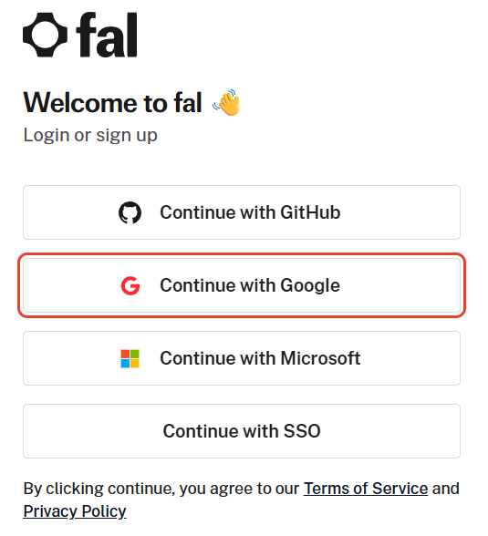
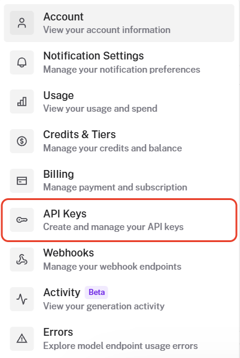
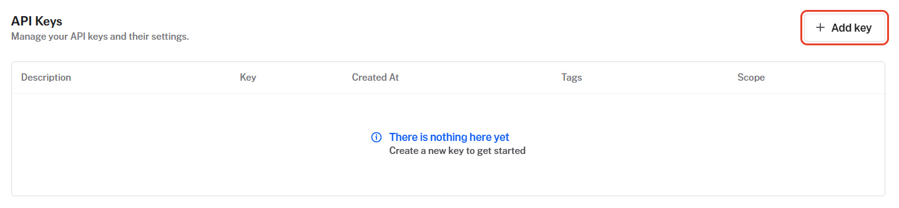
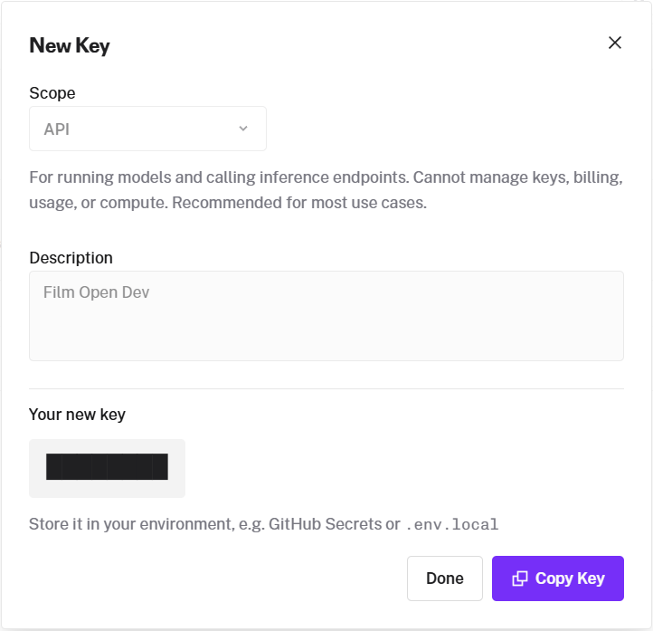
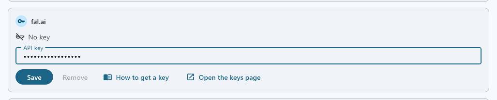
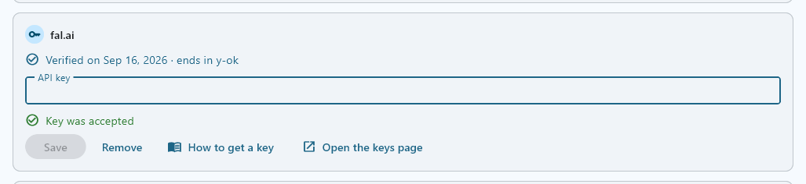

fal runs many makers' image, video and voice models behind one account and one key. FilmOpen uses it for images and video, and, for now, for ElevenLabs' voices. The [technical notes](/docs/platforms/fal-notes/) cover fal's API in more depth.

:::note[About these steps]
The screenshots of fal were taken on its site on 15 September 2026, while an account was opened with Google. Adding credits follows fal's pages, without screenshots. The screenshots of FilmOpen show a stand-in value, never a real key.
:::

## What FilmOpen uses it for

| Model | Made by | What it does in FilmOpen |
|---|---|---|
| Nano Banana Pro and Nano Banana 2 | Google | Make an image from a prompt, or edit one with reference images |
| GPT Image 2.5 | OpenAI | Makes an image from a prompt, or edits one with reference images |
| HiDream-O1-Image | HiDream | Makes an image from a prompt |
| Z-Image-Turbo | Alibaba (Tongyi Lab) | Makes an image from a prompt, quickly and cheaply |
| Qwen-Image-Edit-2511 | Alibaba (Qwen) | Edits an image |
| FLUX.2 [klein] 4B | Black Forest Labs | Edits an image |
| Veo 3.1, Kling 3.0, Seedance 2.5 and MiniMax H3 | Google, Kuaishou, ByteDance and MiniMax | Make a shot from a prompt, from its first frame, or between its first and last frames |
| LTX-2.5 | Lightricks | Does the same, and makes a shot from its first frame timed to your own audio |
| Kling Avatar 2.0 | Kuaishou | Makes a speaking shot from its first frame and a dialogue take |
| Eleven v3 | ElevenLabs | Speaks a line, or a dialogue between several voices |

FilmOpen writes with language models through [OpenRouter](/docs/platforms/openrouter/), and transcribes your voice through [OpenAI](/docs/platforms/openai/).

## What it costs

fal is prepaid: you buy credits, and each request's cost comes off them ([pricing](https://fal.ai/docs/documentation/model-apis/pricing)).
- **What is charged.** What fal makes successfully; time waiting in the queue is free (pricing). A failure on fal's side (a 5xx error) is never charged, but a request refused for its input (a 422 error) can be, when fal had already started working on it ([FAQ](https://fal.ai/docs/documentation/model-apis/faq)).
- **Buying credits.** fal's pages don't publish the smallest purchase or a fee. You pay by card or by ACH bank transfer, in US dollars ([terms](https://fal.ai/legal/terms-of-service)).
- **Expiry and refunds.** Credits expire 365 days after you buy them, and free or promotional credits after 90 days. Credits can't be refunded (terms).
- **Tax.** Prices exclude tax, which you pay on top (terms).

Images:

| Model | Price |
|---|---|
| Nano Banana Pro | $0.15 an image, $0.30 at 4K |
| Nano Banana 2 | $0.08 an image at 1K; $0.06 at 0.5K, $0.12 at 2K and $0.16 at 4K; $0.002 more with high thinking |
| GPT Image 2.5 | Per million tokens: $5 text in, $8 image in, $30 image out |
| HiDream-O1-Image | $0.01 a megapixel |
| Z-Image-Turbo | $0.005 a megapixel |
| Qwen-Image-Edit-2511 | $0.03 a megapixel |
| FLUX.2 [klein] 4B | $0.01 a megapixel |

Web search on either Nano Banana model adds $0.015 a request.

Video, per second of video; each row names the tier compared:

| Model | Compared at | Price |
|---|---|---|
| Veo 3.1 | Lite, 720p | $0.05 with sound, $0.03 without |
| Kling 3.0 | Standard | $0.084 without sound, $0.126 with |
| Seedance 2.5 | 480p | About $0.22, fal's estimate |
| MiniMax H3 | H3 Max, 480p | $0.05; H3 Max Turbo $0.025 |
| LTX-2.5 | Fast, 720p | $0.09 |
| Kling Avatar 2.0 | Standard | $0.0562 |

Voices: Eleven v3 costs $0.10 per 1,000 characters.

Prices were checked on fal's model pages on 14 and 15 September 2026. See [fal's models](https://fal.ai/explore) for today's, and the [technical notes](/docs/platforms/fal-notes/) for more tiers.

## Before you start

You need:
- a GitHub, Google or Microsoft account, or your organisation's single sign-on (SSO). fal has no sign-up with an e-mail address and a password ([sign-in page](https://fal.ai/login));
- a card, or ACH, to buy credits ([terms](https://fal.ai/legal/terms-of-service)).

**Choose one way to sign in and keep to it.** Each way of signing in makes a separate fal account, with its own keys and credits, except that a Google and a GitHub account with the same e-mail address share one; single sign-on always makes its own. fal's page doesn't say whether a Microsoft sign-in joins them ([accounts and identity](https://fal.ai/docs/documentation/setting-up/accounts-and-identity)).

**Two-factor sign-in.** fal's pages don't mention it, so turn it on for the GitHub, Google or Microsoft account you sign in with.

**Checks.** fal's pages don't mention a phone or an identity check, and signing in with Google on 15 September 2026 asked for neither.

fal publishes no list of countries. Its terms make you responsible for US export controls and embargoes ([terms](https://fal.ai/legal/terms-of-service)).

## Create an account

1. Open [fal's sign-in page](https://fal.ai/login) and press **Continue with GitHub**, **Continue with Google**, **Continue with Microsoft** or **Continue with SSO**. The same page signs you up the first time, and continuing accepts fal's Terms of Service and Privacy Policy.

   

2. fal opens its dashboard. Its **Getting started** list takes you through adding a payment method, adding credits and making your first image or video.

## Add money

On the dashboard's **Getting started** list, press **Set up billing** to add a payment method, then **Add credits**. **Settings → Billing** and **Settings → Credits & Tiers** lead to the same places.
- **Paying:** by card or ACH, in US dollars ([terms](https://fal.ai/legal/terms-of-service)).
- **Credits expire** 365 days after you buy them, and can't be refunded (terms).
- **What is charged:** see *What it costs*.

## Create a key

1. Open fal's **Settings** menu and choose **API Keys**, or go straight to [fal's keys page](https://fal.ai/dashboard/keys).

   

2. Press **Add key**. On a new account, the list below says there is nothing here yet.

   

3. In **New Key**, choose **API** as the **Scope**. The window describes it as for running models and calling inference endpoints, unable to manage keys, billing, usage or compute. It is all FilmOpen needs, so don't give FilmOpen the **ADMIN** scope, which can also manage apps ([authentication](https://fal.ai/docs/documentation/setting-up/authentication)). Type a **Description** you'll recognise, such as *FilmOpen*, and create the key.
4. **Your new key** appears. Press **Copy Key** and keep the key somewhere safe, such as a password manager, until you add it to FilmOpen: fal shows it only once. Then press **Done**.

   

## Add the key to FilmOpen

FilmOpen keeps your key on this computer, encrypted by Windows for your Windows user only. It never puts the key in a project or in its log, never shows it again apart from its last four characters, and sends it only to fal. FilmOpen on the web keeps no keys, so use the desktop app.

1. In FilmOpen, open **Settings** and choose the **Provider keys** tab.
2. In the **fal.ai** card, paste your key into **API key** and press **Save**. FilmOpen asks fal about the key before it saves anything, and the card says so while it waits. If what you pasted looks like another platform's key, a line under the box says so and *Save* asks first.

   

3. A green **Key was accepted** appears under the box, the box empties, and the card says **Verified on** the date, with the key's last four characters. FilmOpen saves no key fal did not accept: a red **Key is invalid**, or a **Could not check** line, means nothing was saved, and the box keeps what you pasted so you can put it right or press **Save** again when the connection is back.

   

**If the card says something else:**
- **Key is invalid:** fal refused the key, so nothing was saved and the box keeps it. Check that you copied all of it, or create a new key. If the line says fal knows the key but refused the check, check the key's permissions on fal.
- **Could not check:** fal didn't answer in time, couldn't be reached, or answered with an error. Nothing was saved, and the box keeps the key: press **Save** again when the connection is back.
- **This device's credential store can't be used:** FilmOpen couldn't reach the store where Windows keeps the key encrypted, so nothing changed. The box keeps the key: press **Save** to try again, and if it keeps happening, restart FilmOpen.

**Save** checks the key with fal before it stores anything, without running a model, and stores it only where fal accepts it. **Remove** takes the key out of FilmOpen after asking, and the key keeps working on fal until you delete it there.

After pasting a key anywhere, clear Windows' clipboard history: press Win+V and choose **Clear all**.

## Keep the key safe

- **Anyone with your key can spend your credits.** Never put the key in a chat, an e-mail, a shared document or code.
- **fal's pages document no spending limit** for a key or an account, so keep only the credit you mean to spend there.
- **Give FilmOpen a key with the API scope,** never ADMIN.
- **If it may have leaked,** delete it on the API keys page and create a new one; on a team, only its admins can ([teams](https://fal.ai/docs/documentation/setting-up/teams)).
- **Protect the account** you sign in with by turning on its two-factor sign-in.

## If something goes wrong

- **You lost the key:** fal shows it only once. Create a new one, and delete the old one.
- **You signed in and found an empty account:** each way of signing in makes an account of its own, so sign in the way you did the first time ([accounts and identity](https://fal.ai/docs/documentation/setting-up/accounts-and-identity)).
- **Requests are refused when your credits run out:** fal locks an account whose balance falls below its threshold, and refuses its API requests until you add credits ([FAQ](https://fal.ai/docs/documentation/model-apis/faq)).
- **FilmOpen says the key is invalid, or that it could not check it:** nothing was saved and the box keeps the key, so you can put it right and press *Save* again — see *Add the key to FilmOpen* above for what each line means, and what fal may want you to fix.
