OpenAI makes the GPT models. FilmOpen's first version uses your own OpenAI key for one thing: transcribing your voice as you speak, with GPT-Live-Transcribe. OpenAI's API also writes, returns structured data and makes images, but FilmOpen reaches those models through [OpenRouter](/docs/platforms/openrouter/) and [fal](/docs/platforms/fal/). The [technical notes](/docs/platforms/openai-notes/) cover OpenAI's API in more depth.

:::note[About these steps]
The screenshots of OpenAI were taken on its site on 15 September 2026, and the screenshots of FilmOpen show a stand-in value, never a real key. Some steps weren't tried then: finishing a first payment, what follows *Continue* when buying more credit, auto-reload, a monthly limit, two-factor sign-in, the phone check and deleting a key. Those follow OpenAI's help centre and developer documentation, or what its console showed.
:::

## What FilmOpen uses it for

| Model | What it does in FilmOpen |
|---|---|
| GPT-Live-Transcribe | Turns your speech into text while you talk |

GPT-5.6 Sol, GPT-5.6 Terra and GPT Image 2.5 are on OpenAI's API too, but FilmOpen's first version doesn't use them there: it reaches GPT-5.6 Sol and Terra through [OpenRouter](/docs/platforms/openrouter/), and GPT Image 2.5 through [fal](/docs/platforms/fal/).

## What it costs

OpenAI is prepaid: you buy credit before you use the API.
- **Buying credit.** The smallest purchase is $5, and $10 is filled in. Credit expires a year after you buy it and is not refunded, apart from a few exceptions such as billing errors. Your account's trust tier sets the most credit it can hold ([prepaid billing](https://help.openai.com/en/articles/8264644-how-can-i-set-up-prepaid-billing)).
- **Fees and tax.** OpenAI's billing pages mention no fee for buying credit. Tax is charged on top of its prices where the law requires ([Services Agreement](https://cdn.openai.com/osa/openai-services-agreement.pdf), §6.3), and your billing details can carry a tax or VAT ID ([tax and VAT IDs](https://help.openai.com/en/articles/9038389-updating-billing-information-tax-id-and-vat-id)).

| Model | Standard price |
|---|---|
| GPT-Live-Transcribe | $0.017 per minute of audio |
| GPT-5.6 Sol, not used on OpenAI in the first version | $4 per million input tokens, $20 per million output tokens |
| GPT-5.6 Terra, not used on OpenAI in the first version | $2 per million input tokens, $12 per million output tokens |
| GPT Image 2.5, not used on OpenAI in the first version | $5 per million text tokens in, $8 per million image tokens in, $30 per million image tokens out |

- **Batch requests:** they come back later and cost half.
- **Long prompts:** above 272,000 input tokens they cost more.
- **Usage tiers:** new accounts start at Tier 1 once they have paid $5. Tier 1 allows up to $100 of usage a month, and the limit rises as your spending grows ([rate limits](https://developers.openai.com/api/docs/guides/rate-limits)).

Prices were checked on 14 September 2026. See [OpenAI's pricing](https://developers.openai.com/api/docs/pricing) for today's.

## Before you start

You need:
- an e-mail address, where OpenAI sends a sign-up code, or a Google, Microsoft or Apple account ([sign-in methods](https://help.openai.com/en/articles/4936824-can-i-change-how-i-log-into-my-account-authentication-method));
- a phone that can receive a code by SMS, or by WhatsApp where OpenAI offers it. OpenAI asks for it before your first key, but not to sign up ([phone verification](https://help.openai.com/en/articles/8983040-what-does-phone-verification-look-like));
- a credit or debit card for credit.

**For GPT Image 2.5 on OpenAI,** which FilmOpen's first version doesn't use, OpenAI may ask for organisation verification before first use: a business check, an identity check with a government-issued ID and, if asked, a selfie, or both ([image generation](https://developers.openai.com/api/docs/guides/image-generation), [organisation verification](https://help.openai.com/en/articles/10910291-api-organization-verification)).

**Countries.** OpenAI's API is available in [these countries](https://developers.openai.com/api/docs/supported-countries).

## Create an account

1. Open [OpenAI's sign-up page](https://platform.openai.com/signup). Type your e-mail address and press **Continue**, or press **Continue with Google**, **Continue with Apple** or **Continue with Microsoft**.

   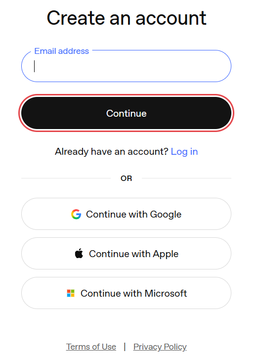

2. OpenAI e-mails you a code. Type it into **Code** and press **Continue**. If no e-mail arrives, press **Resend email**.

   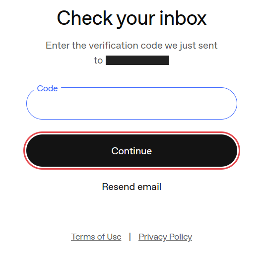

That is the whole sign-up: OpenAI asked for no password, name or birthday. You land on the platform's **Home** page, in an organisation called *Personal* with a project called *Default project*.

**Turn on two-factor sign-in.** Anyone who gets into your account can create keys and spend your credit. OpenAI's help centre says you can turn it on in ChatGPT, under **Settings → Security**, or in the API platform, with an authenticator app, push notifications or a text message. It then protects both ChatGPT and the API platform ([multi-factor authentication](https://help.openai.com/en/articles/7967234-enabling-or-disabling-multi-factor-authentication-mfa)).

## Add money

The API is paid for in advance, and a ChatGPT subscription doesn't pay for it, as the Billing page points out.

1. Open the menu at the bottom of the sidebar, choose **Organization settings**, then **Billing** ([Billing](https://platform.openai.com/settings/organization/billing/overview)).
2. If OpenAI has no card of yours yet, press **Add payment details**.

   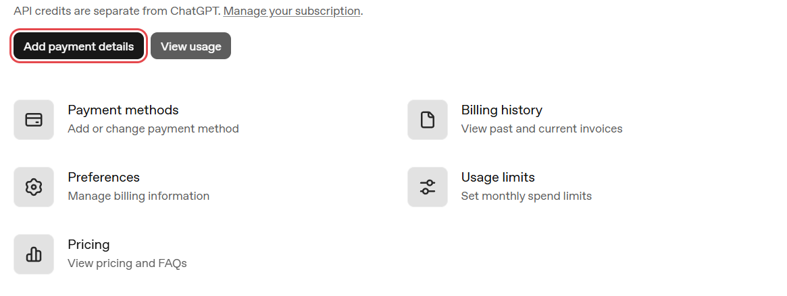

3. Choose **Purchase for myself**, or **Purchase for business** if a company is paying. Enter your card, or use Apple Pay where it is offered, and press **Continue**.

   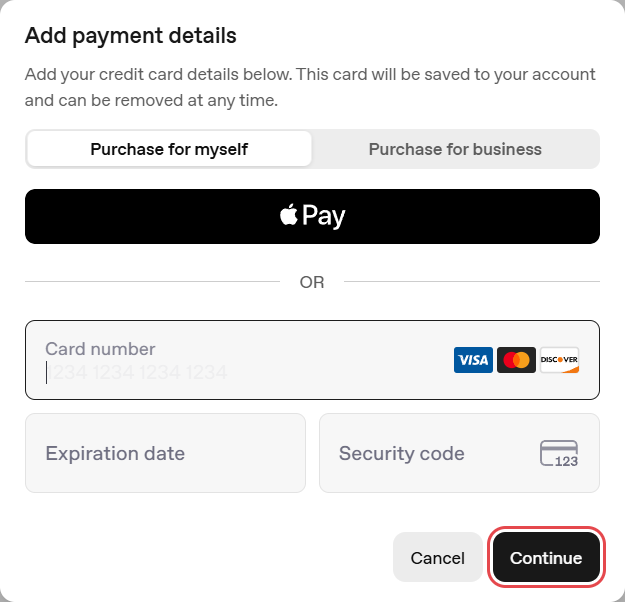

4. **Your first purchase.** Choose how much credit to buy: at least $5, with $10 filled in. **Use auto-reload** is on at this step: turn it off unless you want OpenAI to buy more credit by itself whenever your balance runs low. If you keep it on, set the balance that starts a reload, the balance to restore and, if you like, a monthly limit on reloads. Then confirm the purchase. Your balance can take a few minutes to update ([prepaid billing](https://help.openai.com/en/articles/8264644-how-can-i-set-up-prepaid-billing)).
5. **Buying more later.** Press **Buy credits** on the Billing page. Type the amount under **Amount to add** (the window shows the range your account can add), check the card under **Payment method**, press **Continue** and finish paying. The credit shows as **API credit balance** on the Billing page.

   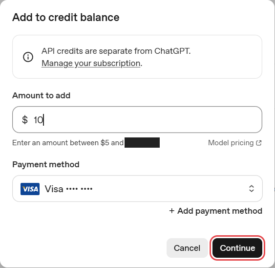

6. **Auto-reload, later.** The Billing page's **Auto-reload credits** shows whether it is on, and **Manage auto-reload** changes it. Its monthly limit caps automatic purchases, not what the API spends ([prepaid billing](https://help.openai.com/en/articles/8264644-how-can-i-set-up-prepaid-billing)).
7. **A monthly limit.** **Usage limits**, on the Billing page, sets monthly spend limits. Once a limit is reached, OpenAI refuses API requests ([spend limits](https://developers.openai.com/api/docs/guides/spend-limits)). Don't treat your balance as an instant stop: usage is counted with a delay, so a balance can dip below zero, and the difference comes off your next purchase ([prepaid billing](https://help.openai.com/en/articles/8264644-how-can-i-set-up-prepaid-billing)).

## Create a key

1. In the sidebar, open **API Keys** and press **Create new secret key**. The first time, OpenAI asks you to verify a phone: choose your country, enter the number, and type the code it sends by SMS, or by WhatsApp where available. Later keys don't ask ([phone verification](https://help.openai.com/en/articles/8983040-what-does-phone-verification-look-like)).

   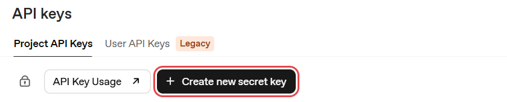

2. Fill in the form, then press **Create secret key**:
   - **Owned by:** leave **You**. OpenAI disables the key if you are ever removed from the organisation or the project.
   - **Name:** one you will recognise, such as *FilmOpen dev*.
   - **Project:** leave **Default project**, unless you made a project for FilmOpen.
   - **Expiration:** 1 day, 7 days, 30 days, Never or Custom. **Create secret key** stays greyed out until you choose. A key that expires does less harm if it leaks, but on that day FilmOpen stops working with it and you need a new one. An administrator can also require keys to expire within a set time ([changelog](https://developers.openai.com/api/docs/changelog)).
   - **Permissions:** **All**, which OpenAI describes as reading and writing API resources. **Restricted** and **Read only** narrow what the key can do.

   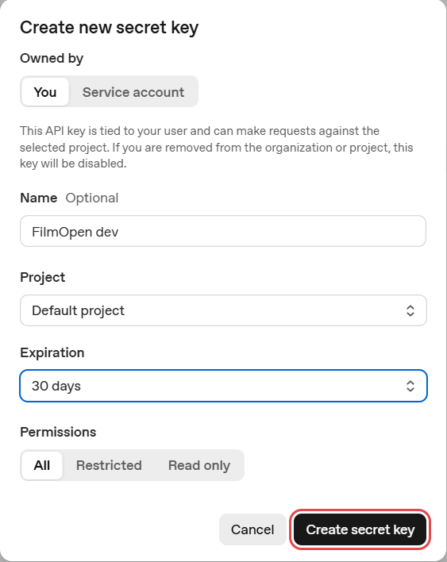

3. **Save your key** shows the key this once: OpenAI cannot show it to you again. Press **Copy** and keep the key somewhere safe: in FilmOpen's Settings → Provider keys once it is built, and in a password manager until then. Then press **Done**.

   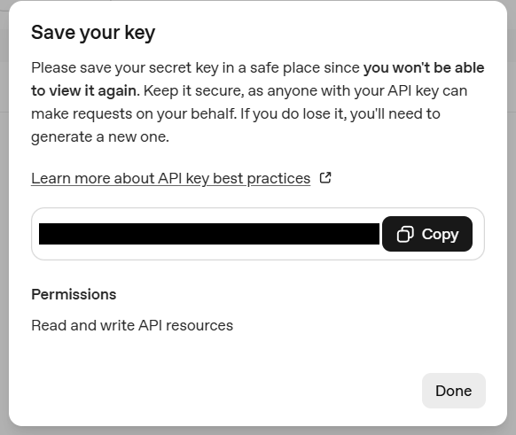

4. The key joins the list, with the day it expires.

   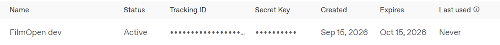

## Add the key to FilmOpen

FilmOpen keeps your key on this computer, encrypted by Windows for your Windows user only. It never puts the key in a project or in its log, never shows it again apart from its last four characters, and sends it only to OpenAI. FilmOpen on the web keeps no keys, so use the desktop app.

1. In FilmOpen, open **Settings** and choose the **Provider keys** tab.
2. In the **OpenAI API** card, paste your key into **Secret key** and press **Save**. FilmOpen asks OpenAI about the key before it saves anything, and the card says so while it waits. If what you pasted looks like another platform's key, a line under the box says so and *Save* asks first.

   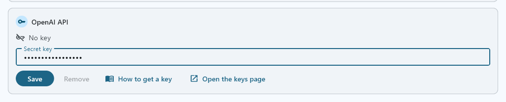

3. A green **Key was accepted** appears under the box, the box empties, and the card says **Verified on** the date, with the key's last four characters. FilmOpen saves no key OpenAI did not accept: a red **Key is invalid**, or a **Could not check** line, means nothing was saved, and the box keeps what you pasted so you can put it right or press **Save** again when the connection is back.

   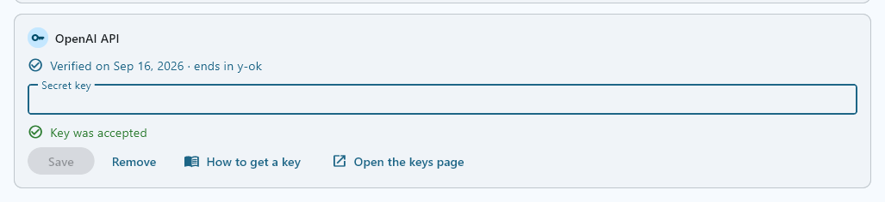

**If the card says something else:**
- **Key is invalid:** OpenAI refused the key, so nothing was saved and the box keeps it. Check that you copied all of it, or create a new key. If the line says OpenAI knows the key but refused the check, check the key's permissions on OpenAI.
- **Could not check:** OpenAI didn't answer in time, couldn't be reached, or answered with an error. Nothing was saved, and the box keeps the key: press **Save** again when the connection is back.
- **This device's credential store can't be used:** FilmOpen couldn't reach the store where Windows keeps the key encrypted, so nothing changed. The box keeps the key: press **Save** to try again, and if it keeps happening, restart FilmOpen.

**Save** checks the key with OpenAI before it stores anything, without running a model, and stores it only where OpenAI accepts it. **Remove** takes the key out of FilmOpen after asking, and the key keeps working on OpenAI until you delete it there.

After pasting a key anywhere, clear Windows' clipboard history: press Win+V and choose **Clear all**.

## Keep the key safe

- **Anyone with your key can use it,** and OpenAI bills you for what they do. Never put the key in a chat, an e-mail, a shared document or code.
- **If it may have leaked,** delete it with the bin at the end of its row on the API keys page, then create a new one.
- **Cap what it can cost:** set a monthly limit and keep auto-reload off (see *Add money*).
- **Let it expire,** so a forgotten key stops working by itself.
- **Turn on two-factor sign-in** (see *Create an account*).

## If something goes wrong

- **"Oops! We couldn't add this payment method, please report this issue if it persists."** On 15 September 2026 a new account's card was turned down with this message at once, before its bank saw any charge. Developers on OpenAI's forum have reported failing cards, and payments that did not become credit, since 11 September 2026 ([forum thread](https://community.openai.com/t/adding-new-payment-method-broken-on-web-at-platform-api/1396741)). Try again later, or ask OpenAI's support through its [help centre](https://help.openai.com/).
- **A payment shows but no credit appears.** Don't pay again. A balance can take a few minutes to update ([prepaid billing](https://help.openai.com/en/articles/8264644-how-can-i-set-up-prepaid-billing)); if the payment is under Billing history and the credit still doesn't come, ask OpenAI's support.
- **"Failed to load credit balance."** A new account's Billing page said this on 15 September 2026, before any card was saved.
- **Create secret key is greyed out:** choose an **Expiration**.
- **You lost the key:** OpenAI cannot show it again. Create a new key and delete the old one.
- **The key stopped working:** look at **Expires** in its row, and at your credit on the Billing page. The [technical notes](/docs/platforms/openai-notes/) list the errors OpenAI returns.
- **FilmOpen says the key is invalid, or that it could not check it:** nothing was saved and the box keeps the key, so you can put it right and press *Save* again — see *Add the key to FilmOpen* above for what each line means, and what OpenAI may want you to fix.
