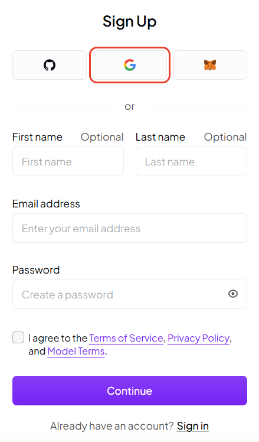
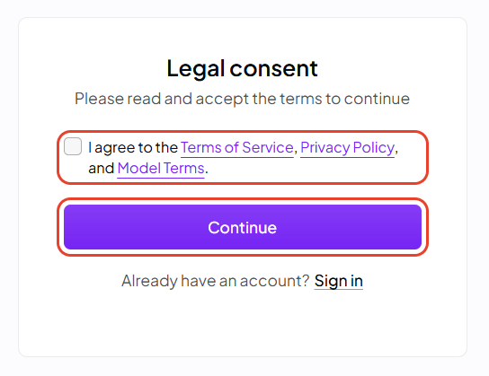
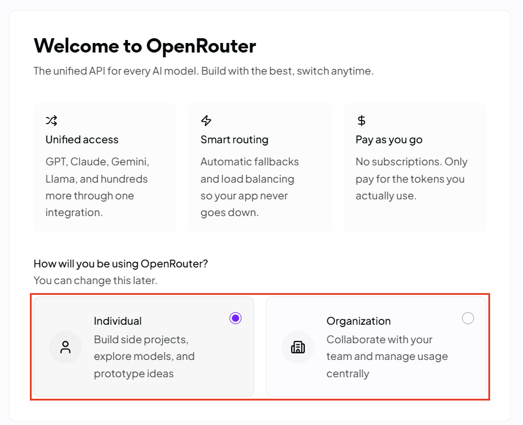
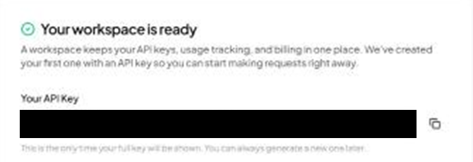
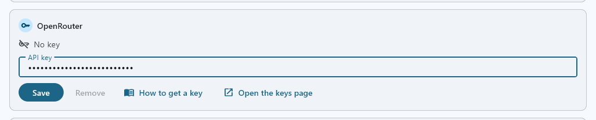
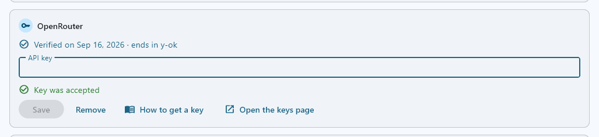

OpenRouter sells many makers' language models through one account, one balance and one key. FilmOpen uses it for every language model. With your own OpenRouter key, FilmOpen can write with Claude Opus 5, GPT-5.6 Sol or Gemini 3.1 Pro, and turn text into structured data with Claude Sonnet 5, GPT-5.6 Terra or Gemini 3.8 Flash. The [technical notes](/docs/platforms/openrouter-notes/) cover OpenRouter's API in more depth.

:::note[About these steps]
The screenshots of OpenRouter were taken on its site on 15 September 2026, while an account was opened with Google. Adding credits and making further keys follow OpenRouter's documentation, without screenshots. The screenshots of FilmOpen show a stand-in value, never a real key.
:::

## What FilmOpen uses it for

| Model | Made by | What it does in FilmOpen |
|---|---|---|
| Claude Opus 5 | Anthropic | Writes prose, scenes, dialogue and scripts from your instructions and the story so far |
| GPT-5.6 Sol | OpenAI | Writes, like Claude Opus 5 |
| Gemini 3.1 Pro | Google | Writes, like Claude Opus 5 |
| Claude Sonnet 5 | Anthropic | Reads text and returns structured data, such as the characters in a synopsis |
| GPT-5.6 Terra | OpenAI | Returns structured data, like Claude Sonnet 5 |
| Gemini 3.8 Flash | Google | Returns structured data, like Claude Sonnet 5 |

FilmOpen makes images, video and voices through [fal](/docs/platforms/fal/), and transcribes your voice through [OpenAI](/docs/platforms/openai/).

## What it costs

OpenRouter is prepaid: you buy credits, and each request's cost comes off your balance.
- **Buying credits.** A purchase is between $5 and $25,000 ([terms](https://openrouter.ai/terms), §4.1). Paying by card adds a fee of 5.5%, at least $0.80; paying in crypto adds 5% ([FAQ](https://openrouter.ai/docs/faq)).
- **Refunds.** You can ask for unused credits back within 24 hours of a purchase; after that they can't be refunded. The fee is never refunded, and neither is a crypto payment (terms, §4.1).
- **Expiry.** OpenRouter may expire credits still unused 365 days after you bought them (terms, §4.2).
- **Tax.** OpenRouter's pages don't say whether tax is added.

Prices per million tokens, input / output, for ordinary prompts:

| Model | OpenRouter | From its maker |
|---|---|---|
| Claude Opus 5 | $5 / $25 | Anthropic: $5 / $25 |
| Claude Sonnet 5 | $2 / $10 | Anthropic: $2 / $10 |
| GPT-5.6 Sol | $2 / $10, marked 50% off | OpenAI: $4 / $20 |
| GPT-5.6 Terra | $2 / $12 | OpenAI: $2 / $12 |
| Gemini 3.1 Pro | $2 / $12 | Google: $2 / $12 |
| Gemini 3.8 Flash | $0.75 / $3.75, marked 50% off | Google: $0.75 / $3.75 until 31 December 2026, then $1.50 / $7.50 |

- **Discounts.** OpenRouter marks GPT-5.6 Sol and Gemini 3.8 Flash 50% off, with no end date ([discounted models](https://openrouter.ai/collections/discounted-models)).
- **Providers.** Several providers serve each model, and OpenRouter picks one for each request, weighing price and skipping any that are down ([provider selection](https://openrouter.ai/docs/guides/routing/provider-selection)). The table gives the price of each model's maker's own service. Others can charge much more: GPT-5.6 Sol costs $4.40 / $22 on Amazon Bedrock and up to $5.50 / $33 on Azure, without the discount; Gemini's *priority* service costs 1.8 times as much, and Claude Opus 5's *fast* service twice as much (as OpenRouter lists each model's providers, such as [GPT-5.6 Sol's](https://openrouter.ai/api/v1/models/openai/gpt-5.6-sol/endpoints)).
- **Long prompts** cost more: from 272,000 input tokens, GPT-5.6 Sol costs $4 / $15 and GPT-5.6 Terra $4 / $18; above 200,000, Gemini 3.1 Pro costs $4 / $18.

OpenRouter's prices were checked on 15 September 2026, the makers' on 14 September 2026. See [OpenRouter's models](https://openrouter.ai/models) for today's.

## Before you start

You need:
- a GitHub, Google or MetaMask account, or an e-mail address and a password, as OpenRouter's sign-up page offered on 15 September 2026;
- to be at least 18 ([terms](https://openrouter.ai/terms), §2);
- a card, AliPay or USDC, to buy credits ([FAQ](https://openrouter.ai/docs/faq)).

OpenRouter's pages don't mention a phone check, an identity check or two-factor sign-in, and they give no list of countries. Some model providers don't let people in certain countries or regions use their models ([terms](https://openrouter.ai/terms), §5.7).

## Create an account

1. Open [OpenRouter's sign-up page](https://openrouter.ai/sign-up). Press one of the three logo buttons at the top, for GitHub, Google or MetaMask, or type your e-mail address and a password; your first and last name are optional.

   

2. Tick **I agree to the Terms of Service, Privacy Policy, and Model Terms** and press **Continue**. Signing up with Google, this came afterwards, on a page of its own, **Legal consent**.

   

3. **Welcome to OpenRouter** asks how you will use it. Choose **Individual**, or **Organization** if a team will share the account; you can change this later. Press **Next**, at the bottom right.

   

4. The next welcome step shows your first API key: see *Create a key* before you move on from it.

**Protect the account.** OpenRouter's pages don't mention two-factor sign-in, so if you sign in with GitHub or Google, turn it on for that account.

## Add money

A later welcome step asks for your card and how much credit to buy. You can buy more at any time on OpenRouter's [credits page](https://openrouter.ai/settings/credits) ([organisations](https://openrouter.ai/docs/cookbook/administration/organization-management)).
- **The amount:** between $5 and $25,000 a purchase, plus the card fee of 5.5%, at least $0.80 (see *What it costs*).
- **Automatic top-up is optional.** When you buy credits you can have OpenRouter charge your card again whenever your balance falls below a threshold you set. Leave it off unless you want that (terms, §4.2).
- **Changed your mind?** Ask for a refund of unused credits within 24 hours (terms, §4.1).
- **When credits run out,** OpenRouter refuses requests once your balance falls below zero ([limits](https://openrouter.ai/docs/api_reference/limits)).

## Create a key

1. **Your first key comes with your account.** The welcome step **Your workspace is ready** shows an API key OpenRouter has made for you, and shows it in full only this once. Press the copy button beside it, and keep the key somewhere safe, such as a password manager, until you add it to FilmOpen.

   

2. **A key with a spending limit.** On OpenRouter's [API keys page](https://openrouter.ai/settings/keys) you can create more keys, each with a name and, if you like, a credit limit ([authentication](https://openrouter.ai/docs/api_reference/authentication)). A key that has spent its limit is refused ([limits](https://openrouter.ai/docs/api_reference/limits)). A key just for FilmOpen, with a limit, caps what FilmOpen can spend; delete any key you don't use.

The key starts `sk-or-v1-`.

## Add the key to FilmOpen

FilmOpen keeps your key on this computer, encrypted by Windows for your Windows user only. It never puts the key in a project or in its log, never shows it again apart from its last four characters, and sends it only to OpenRouter. FilmOpen on the web keeps no keys, so use the desktop app.

1. In FilmOpen, open **Settings** and choose the **Provider keys** tab.
2. In the **OpenRouter** card, paste your key into **API key** and press **Save**. FilmOpen asks OpenRouter about the key before it saves anything, and the card says so while it waits. OpenRouter's keys start with `sk-or-v1-`: if what you pasted doesn't, or it looks like another platform's key, a line under the box says so and *Save* asks first.

   

3. A green **Key was accepted** appears under the box, the box empties, and the card says **Verified on** the date, with the key's last four characters. FilmOpen saves no key OpenRouter did not accept: a red **Key is invalid**, or a **Could not check** line, means nothing was saved, and the box keeps what you pasted so you can put it right or press **Save** again when the connection is back.

   

**If the card says something else:**
- **Key is invalid:** OpenRouter refused the key, so nothing was saved and the box keeps it. Check that you copied all of it, or create a new key. If the line says OpenRouter knows the key but refused the check, check the key's permissions on OpenRouter.
- **Could not check:** OpenRouter didn't answer in time, couldn't be reached, or answered with an error. Nothing was saved, and the box keeps the key: press **Save** again when the connection is back.
- **This device's credential store can't be used:** FilmOpen couldn't reach the store where Windows keeps the key encrypted, so nothing changed. The box keeps the key: press **Save** to try again, and if it keeps happening, restart FilmOpen.

**Save** checks the key with OpenRouter before it stores anything, without running a model, and stores it only where OpenRouter accepts it. **Remove** takes the key out of FilmOpen after asking, and the key keeps working on OpenRouter until you delete it there.

After pasting a key anywhere, clear Windows' clipboard history: press Win+V and choose **Clear all**.

## Keep the key safe

- **Anyone with your key can spend your credits.** Never put the key in a chat, an e-mail, a shared document or code.
- **Give it a credit limit,** so a leaked key can spend only so much (see *Create a key*).
- **If it may have leaked,** delete it on the API keys page and create a new one. OpenRouter also looks for its keys in public code on GitHub and e-mails you when it finds one ([authentication](https://openrouter.ai/docs/api_reference/authentication)).
- **Protect the account.** If you sign in with GitHub or Google, turn on that account's two-factor sign-in; with an e-mail address, choose a password you use nowhere else.

## If something goes wrong

- **You moved on without copying the first key:** OpenRouter shows a key in full only once. Create a new one on the API keys page, and delete the one you didn't copy.
- **Requests are refused for credits:** your balance has fallen below zero, or the key has spent its credit limit ([limits](https://openrouter.ai/docs/api_reference/limits)). Add credits, or raise the key's limit.
- **FilmOpen says the key is invalid, or that it could not check it:** nothing was saved and the box keeps the key, so you can put it right and press *Save* again — see *Add the key to FilmOpen* above for what each line means, and what OpenRouter may want you to fix.
