xAI makes the Grok models. FilmOpen can use your own xAI key for one thing: transcribing your voice as you speak, with grok-voice-transcribe-2.0. It is a second dictation engine beside [OpenAI's](/docs/platforms/openai/), and costs about a fifth as much by the minute. xAI's API also writes, makes images and video, and runs voice agents, but FilmOpen doesn't use those. The [technical notes](/docs/platforms/xai-notes/) cover xAI's API in more depth.

:::note[About these steps]
The screenshots of xAI were taken in its console on 18 September 2026, where the console calls itself the *SpaceXAI Console*. The screenshots of FilmOpen show a stand-in value, never a real key; a real key made in these steps was then saved in FilmOpen, which xAI accepted. Some steps weren't photographed: the e-mail code at sign-up, finishing a card payment, and deleting a key. Those follow xAI's documentation or what its console showed.
:::

## What FilmOpen uses it for

| Model | What it does in FilmOpen |
|---|---|
| grok-voice-transcribe-2.0 | Turns your speech into text while you talk, over xAI's live connection |

FilmOpen dictates with one engine at a time, and you choose it in Settings (see *Add the key to FilmOpen*). xAI's speech to text understands 25 languages, English, Spanish and Portuguese among them ([speech to text](https://docs.x.ai/developers/model-capabilities/audio/speech-to-text)).

**An OpenRouter key can't dictate with Grok.** OpenRouter lists xAI's speech to text, but only for a recording sent whole, not live as you speak, so FilmOpen needs a key from xAI itself.

## What it costs

xAI is prepaid: you buy credit before you use the API, and what you use is taken from your balance.
- **Buying credit is a one-off purchase, not a subscription.** You're charged when you buy the credit ([billing FAQ](https://docs.x.ai/docs/resources/faq-api/billing)), and xAI's invoice for it says *Single Purchase*. With the setting xAI starts you on, requests are refused once the credit is used up, rather than billed later ([billing](https://docs.x.ai/console/billing)).
- **Auto top-up is what can charge you again.** It is on at your first purchase unless you turn it off (see *Add money*).
- **Refunds.** xAI doesn't refund prepaid credit, except where the law requires it ([billing FAQ](https://docs.x.ai/docs/resources/faq-api/billing)). Its billing pages give no expiry date for credit.
- **Fees and tax.** xAI's prices are before tax, and its enterprise terms say you pay any card-processing fee as well ([terms](https://x.ai/legal/terms-of-service-enterprise), *Fees, Payment, and Taxes*).

| Model | Standard price |
|---|---|
| grok-voice-transcribe-2.0, live | $0.20 an hour of audio, about $0.0033 a minute |

At that price, $5 of credit is about 25 hours of dictation and $50 about 250. OpenAI's GPT-Live-Transcribe costs $0.017 a minute, about five times as much.

- **Usage tiers:** a team starts at Tier 0 and moves up by what it has paid xAI: Tier 1 from $50, Tier 2 from $250. A tier never goes back down. For speech to text, Tier 0 allows 100 sessions at once and Tier 1 allows 200, far more than one person dictating needs ([rate limits](https://docs.x.ai/developers/rate-limits)).

Prices were checked on 18 September 2026. See [xAI's pricing](https://docs.x.ai/developers/pricing) for today's.

## Before you start

You need:
- a Google, X, Apple or GitHub account, or an e-mail address, where xAI may send a code to check it's yours;
- a card (Visa, Mastercard or Discover) or Cash App Pay, for credit.

## Create an account

1. Open [xAI's sign-up page](https://console.x.ai/login?mode=sign-up). Press **Continue with Google**, **Continue with X**, **Continue with Apple** or **Continue with GitHub**, or type your e-mail address and press **Continue with email**. Continuing means agreeing to xAI's Terms of Service and Privacy Policy, as the page says.

   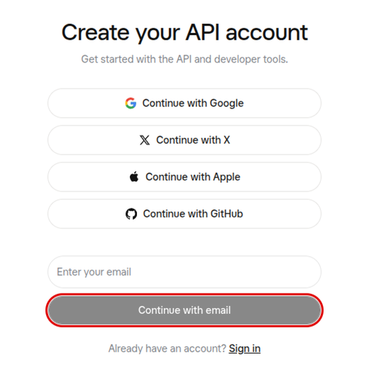

2. If you signed up by e-mail, xAI may ask for a code it sends you: type it in to go on.
3. **Create your team.** Type a **Team name**, such as *FilmOpen*, choose what best describes you (**Hobbyist**, **Student**, **Engineer**, **Business** or **Other**) and press **Continue**. Your keys and your credit belong to the team.

   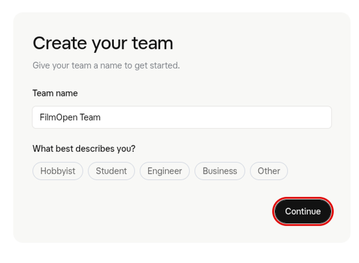

## Add money

1. **Choose your starting point.** The three cards only fill in an amount:
   - **Explore**, free: look around the playgrounds and the documentation. The API refuses requests until you have credit.
   - **Prototype**, from $5, filling in $5.
   - **Build**, from $50, filling in $50.

   What you pay is the amount in the box under the cards, and you can type another. The *~4M input tokens* and *~40M input tokens* on the cards are for xAI's text models, not dictation.

   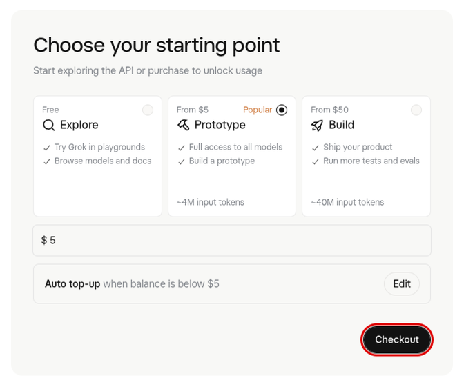

2. **Decide about auto top-up before you pay.** The line under the amount reads **Auto top-up when balance is below $5**: it is on. Press **Edit** to see it:
   - **When credit balance drops below:** $5 filled in.
   - **Top up amount:** it follows the amount you buy, so with **Build** it is $50, charged again each time your balance drops below $5.
   - **Maximum monthly top-up amount:** off, so nothing caps what it spends in a month. xAI's only other limit is 200 top-ups in 24 hours ([billing](https://docs.x.ai/console/billing)).

   Turn **Auto top-up** off unless you want xAI to buy credit by itself. If you keep it on, lower the top-up amount or switch on a monthly maximum. xAI's own advice is to keep it on, so that the API never stops mid-task. It can be turned off at any time ([billing](https://docs.x.ai/console/billing)).

   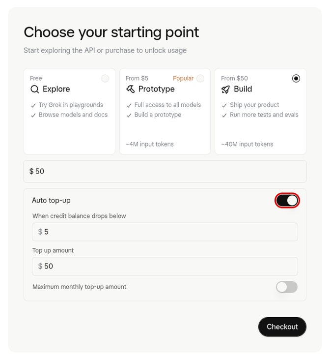

3. Press **Checkout**. On **Purchase your first credits**, choose **Card** or **Cash App Pay**. For a card, enter its number, expiry date and security code, your country and ZIP code, and press **Pay** with your amount. The page reminds you that a card given here can be charged again, which is how auto top-up pays.

   

4. You land on the console's dashboard, with your **Credit balance**. Its **Create API key** button, outlined, is where *Create a key* below begins.

   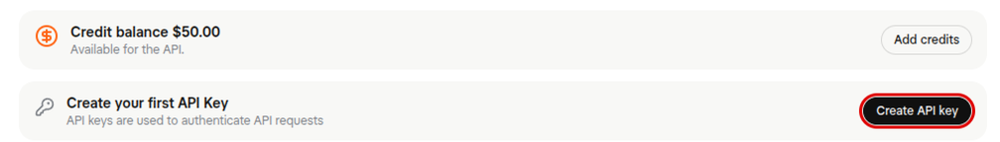

5. **Later: the Billing page.** It is under your team's settings ([Billing](https://console.x.ai/team/default/billing)), and it shows your credit and whether auto top-up is on. **Enable auto top-up** turns it on, **Add credits** buys more, **Redeem promo code** takes a code, and further down, **Invoices** lists every purchase.

   

## Create a key

1. In the sidebar, open **API Keys** ([API keys](https://console.x.ai/team/default/api-keys)) and press **Create API key**. Don't confuse it with **Management Keys**, under the team's settings, which manage the account rather than call models.

   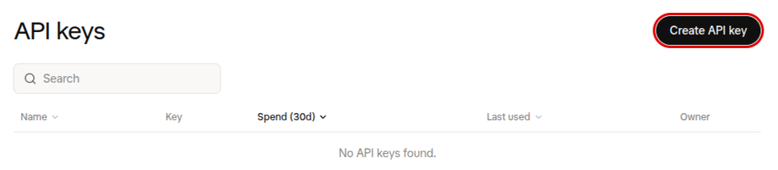

2. Fill in the form, then press **Create API key**:
   - **Name:** one you will recognise, such as *FilmOpen dev*.
   - **Advanced settings** holds the rest, and can be left as it is:
     - **Models:** **All models**. The list offers only Chat, Image and Video, with no speech model, so narrowing it could leave out the one FilmOpen dictates with.
     - **Endpoints:** **All endpoints**. The list includes **Voice**, which FilmOpen's dictation needs. This guide's key was made with all of them, and a key narrowed to Voice alone hasn't been tried with FilmOpen.
     - **Tokens per minute** and **Requests per minute:** no limit.
     - **Expiry:** **No expiry**, or a date. A key that expires does less harm if it leaks, but on that day FilmOpen stops dictating with it and you need a new one.

   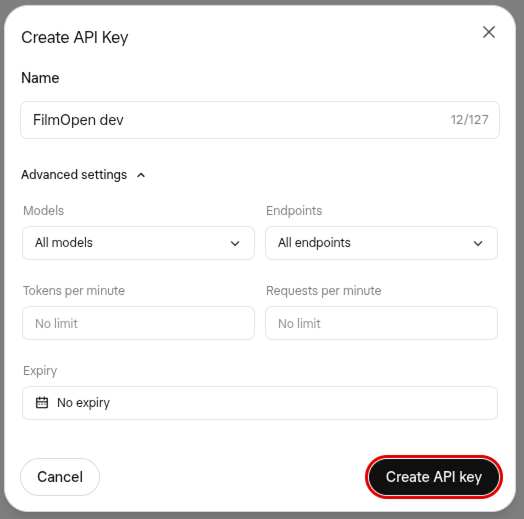

3. **All set, here is your API key** shows the key this once: xAI won't show it again. Press **Copy API Key** and keep the key somewhere safe, such as a password manager. Then press **Done**. The key starts with `xai-`.

   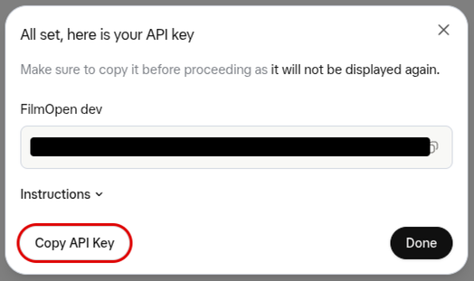

4. The key joins the list with its name, the first and last characters of the key, what it has spent in 30 days and when it was last used.

   

## Add the key to FilmOpen

FilmOpen keeps your key on this computer, encrypted in your operating system's credential store, for your user only. It never puts the key in a project or in its log, never shows it again apart from its last four characters, and sends it only to xAI. FilmOpen on the web keeps no keys, so use the desktop app.

1. In FilmOpen, open **Settings** and choose the **Provider keys** tab.
2. In the **xAI (Grok)** card, paste your key into **API key** and press **Save**. FilmOpen asks xAI about the key before it saves anything, and the card says so while it waits. If what you pasted doesn't start with `xai-`, or looks like another platform's key, a line under the box says so and *Save* asks first.

   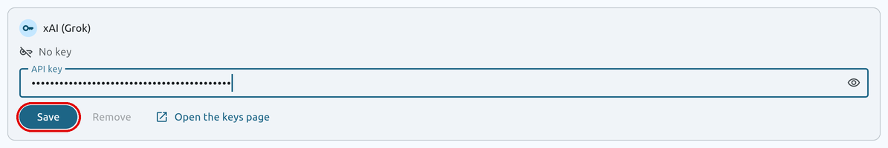

3. A green **Key was accepted** appears under the box, the box empties, and the card says **Verified on** the date, with the key's last four characters.

   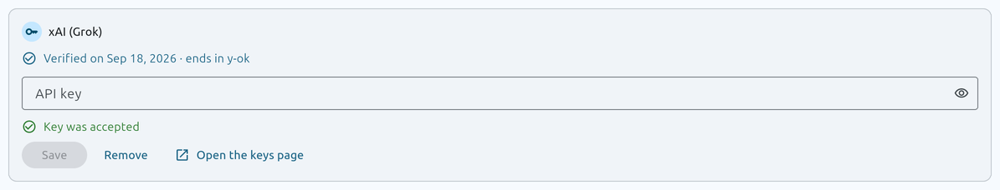

4. **Choose xAI for dictation.** At the top of the same tab, open **Dictation engine** and choose **xAI (Grok) · grok-voice-transcribe-2.0 · $0.0033 a minute**. OpenAI stays the engine until you do. The change takes effect the next time you dictate, and a dictation already under way keeps its engine.

   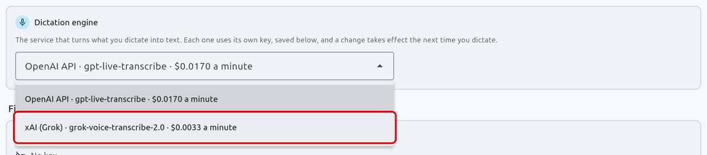

**If the card says something else:**
- **Could not check**, with *xAI (Grok) answered with status…* or *could not be reached*: nothing was saved, and the box keeps the key. xAI answers a wrong key with status 400, so if the connection is fine, check that you copied all of the key, or create a new one.
- **Key is invalid:** xAI refused the key, so nothing was saved and the box keeps it. Copy it again, or create a new key.
- **This device's credential store can't be used:** FilmOpen couldn't reach the store where your system keeps the key encrypted, so nothing changed. The box keeps the key: press **Save** to try again, and if it keeps happening, restart FilmOpen.

**Save** checks the key with xAI before it stores anything, without running a model. **Remove** takes the key out of FilmOpen after asking, and the key keeps working on xAI until you delete it there.

After pasting a key anywhere, clear your clipboard history if your system keeps one: on Windows, press Win+V and choose **Clear all**.

## Keep the key safe

- **Anyone with your key can use it,** and xAI takes what they spend from your credit. Never put the key in a chat, an e-mail, a shared document or code.
- **If it may have leaked,** delete it on the API keys page, then create a new one.
- **Cap what it can cost:** keep auto top-up off, or give it a monthly maximum (see *Add money*).
- **Let it expire,** if you'd rather a forgotten key stopped working by itself.

## If something goes wrong

- **You aren't sure whether $5 or $50 is a subscription.** Neither is: each is credit bought once. Only auto top-up buys again, and you can turn it off before you pay or on the Billing page.
- **The API refuses requests:** look at your credit on the Billing page. With no credit and no invoiced billing, xAI turns requests down ([billing](https://docs.x.ai/console/billing)).
- **You lost the key:** xAI can't show it again. Create a new key and delete the old one.
- **FilmOpen says it could not check the key, or that the key is invalid:** nothing was saved and the box keeps the key, so you can put it right and press *Save* again. See *Add the key to FilmOpen* above for what each line means.
- **Dictation still uses OpenAI:** choose xAI under **Dictation engine**, then start a new dictation.
