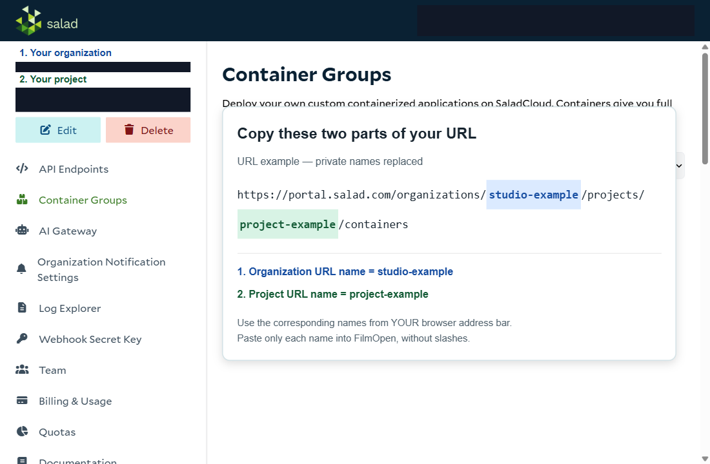

Salad lets you rent a GPU computer to render images without using your own GPU. FilmOpen starts that computer for you, connects to it, and lets you choose it in the render dialog.

You need a Salad account, an organization and project in that account, and a Salad API key. Starting a server uses your Salad balance; entering your settings and checking your key does not start a server.

## 1. Enable the three plugins

In FilmOpen, [install and allow](../plugin-packages/#install-and-allow):

- **SaladCloud servers** (`fo-salad`): starts and stops the rented computer.
- **ComfyUI** (`fo-cui`): connects to the renderer on that computer.
- **Z-Image Turbo** (`fo-cui-zimage`): generates the image.

Open **Settings → Plugins → SaladCloud servers → Open**.

### What “Settings on this computer” means

FilmOpen saves these choices **on the computer you are using**. The organization and project identify where to create servers **in your Salad account**. You are not editing Salad's organization or project settings, and you do not need to install Salad software on your computer.

## 2. Find the two names in your Salad address bar

1. Open the [Salad portal](https://portal.salad.com/organizations/) and sign in.
2. Open the organization you want to use.
3. Open its project, then its containers page.
4. Look at the browser's address bar. It should include both `/organizations/` and `/projects/`.

The starting page, `https://portal.salad.com/organizations`, **does not contain either value yet**. Open an organization and a project first.

For example, a project address could be:

```text
https://portal.salad.com/organizations/studio-example/projects/project-example/containers
```




*Account details, organization/project identifiers and server entries are hidden. The added URL callout uses example names; copy the corresponding segments from your own browser's address bar.*

| FilmOpen field | Which part to copy | Value in this example |
|---|---|---|
| **Organization URL name** | The text immediately after `/organizations/`, up to the next `/` | `studio-example` |
| **Project URL name** | The text immediately after `/projects/`, up to the next `/` | `project-example` |

Copy **your own address-bar values**, not the example values above. Paste only the name into each FilmOpen field: no full URL, no slashes, no spaces. Keep the lowercase spelling and any hyphens. A display title such as “My Studio” may differ from the URL name.

A project may be named `default`; use it only if your address actually says `/projects/default/`. If your account has no organization or project yet, create them in Salad before continuing.

## 3. Save and verify your API key

1. In Salad, open the [API-key page](https://portal.salad.com/api-key).
2. Copy your key privately. Do not put it into the organization or project fields.
3. In FilmOpen, open **Settings → Provider keys**, find **Salad API key**, paste it, and save it.
4. Check the verification result. Enter the organization name first: key verification uses that organization.

The key is kept in your device's credential store. A successful key check confirms access to the organization; it does not prove a server is available, that the project name is correct, or that an image can already be rendered.

## 4. Start a server from Render

1. Open a character you can edit.
2. Use its reference-image add control and choose **Render**.
3. Under **Model**, choose **Z-Image Turbo**. Press **Start server** and wait for the available choices. This can take around a minute or longer and does not rent a server yet.
4. Choose a GPU at the displayed hourly price. For your first test, use a choice with enough VRAM for **8 GB Quality**.
5. Leave the inactivity timeout at **15 minutes**, or enter a whole number from **5 to 60**.
6. Press **Deploy** once. This is the point where FilmOpen asks Salad to start your rented computer.
7. Wait for the server to become ready. Starting it and downloading its models can take several minutes and consume paid running time.
8. Under **Runs on**, select the Salad server. Under **Way of running it**, choose **8 GB Quality**. Choose a supported resolution, enter a short prompt, and press **Render** once.

For a small first test, choose the lowest resolution that the Quality option offers. The resulting image should appear in the character's reference images.

The supplied Salad setup includes the Z-Image **8 GB Quality** and **24 GB Quality** model files. The latter requires a suitable 24 GB GPU. It does **not** include the **8 GB Fast** or LTX video model files. Choosing a larger GPU does not install extra models.

## 5. Stop when you finish

Press **Stop** in FilmOpen's server panel. Then open the same project in the Salad portal and confirm the server is **stopped** with **zero active instances**.

Closing Render, closing FilmOpen, or turning off a plugin is not a substitute for confirming that the rented server stopped. An inactivity shutdown is configured with Salad, but after a lost connection or interrupted deployment you should check the portal before leaving it running.

If Deploy or Render times out, **check the server and job before pressing it again**. The first request may have reached Salad even if FilmOpen did not receive its answer.

## If something does not work

| What you see | What to check |
|---|---|
| The URL is only `/organizations` | Open an organization, then a project. The two names are not on the starting page. |
| A configuration error or rejected key check | Organization spelling comes from the URL, not its display title. Check it before replacing the key. |
| Key verified, but the project cannot be used | Check the project portion of the URL and your account's permission to use that project. Key verification alone checks the organization. |
| The device credential store cannot be used | FilmOpen could not save the key securely on this device. Resolve the device/app credential-store problem; changing the two URL names will not fix it. |
| No available servers | Wait and refresh. Suitable capacity may be unavailable; an empty list does not necessarily mean your key is wrong. Use `fo-salad v3` or later. |
| Server starting for a long time | Initial setup downloads model files. Leave it supervised and watch the portal; there is no guaranteed startup time. |
| Missing model files | Choose a Quality stack included in the Salad setup. A local ComfyUI model downloader cannot install files on this remote server. |
| Connection lost or no image returned | Inspect the server in Salad and confirm its stop state. Do not automatically submit a second potentially paid job. |

**Cloud rendering is still being verified.** Earlier Windows testing found a server-discovery mismatch and a lost connection during a render. Account/key setup can succeed while rendering still fails. These problems remain under review; this guide does not claim the current cloud path is fully tested.

<details>
<summary>More about prices, connections and shutdown</summary>

Salad charges for server running time, including startup and model setup. A zero additional image-API cost is not free GPU time. FilmOpen's compute-cost display is an estimate from duration and the hourly price, not a reconciled Salad invoice.

Availability is an estimate rather than a reservation. Choices expire after five minutes; if capacity changes, refresh and select again. The current setup requests at least 4 vCPUs, 24 GiB RAM and 50 GiB disk as well as the selected GPU.

FilmOpen connects through Salad's authenticated gateway, not a public ComfyUI page on an open port. The management key remains in FilmOpen, outside the rented container. Each render keeps the server selected for that job.

The inactivity deadline uses [Salad's scheduled scaling](https://docs.salad.com/container-engine/how-to-guides/autoscaling/time-of-day-scaling). FilmOpen checks that deadline before starting the server and renews it during active work. If FilmOpen disappears, the last acknowledged schedule remains; provider timing and execution delay still apply. Independent server-side protection for stuck sessions is planned, so keep cloud use supervised.

A previous lab run took about 21 minutes for initial setup, then about 49 seconds for a 1024×1024 image on an RTX 3090. Those timings are examples, not guarantees. The rented computer's disk is disposable; do not treat it as permanent storage for project media.

</details>

Plugin type: [Server Providers](../plugin-types/server-providers/).
